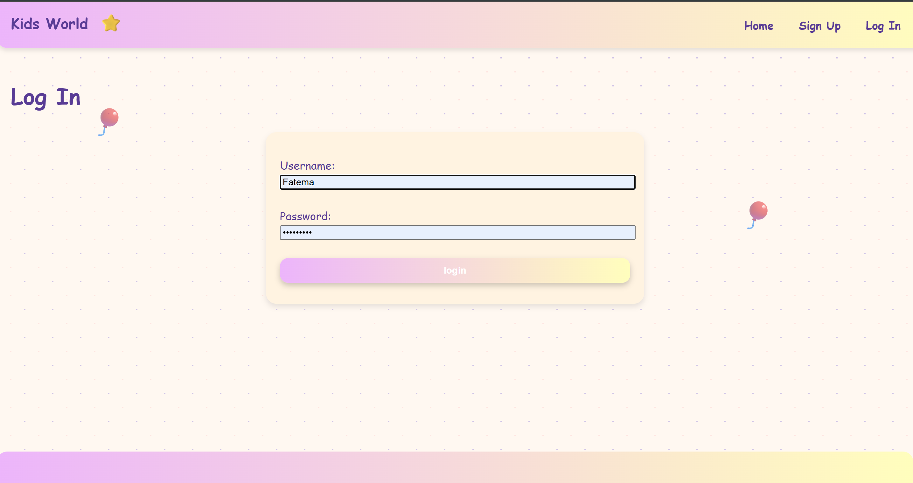
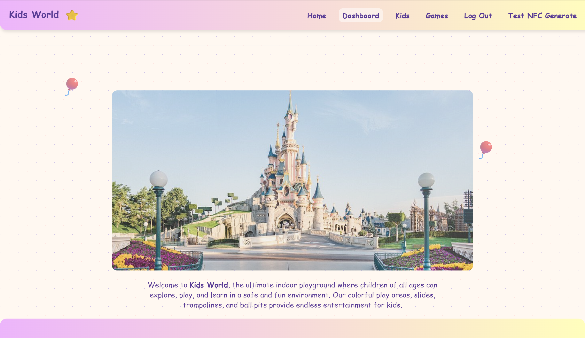
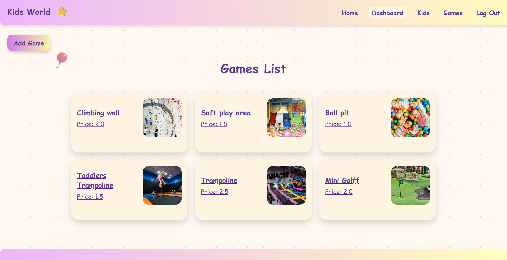
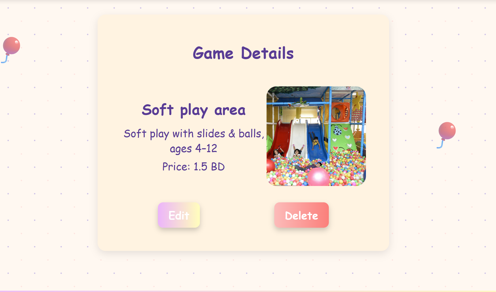
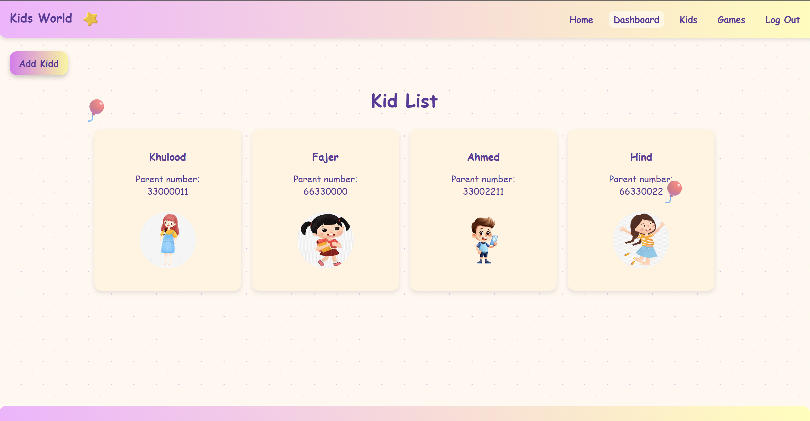
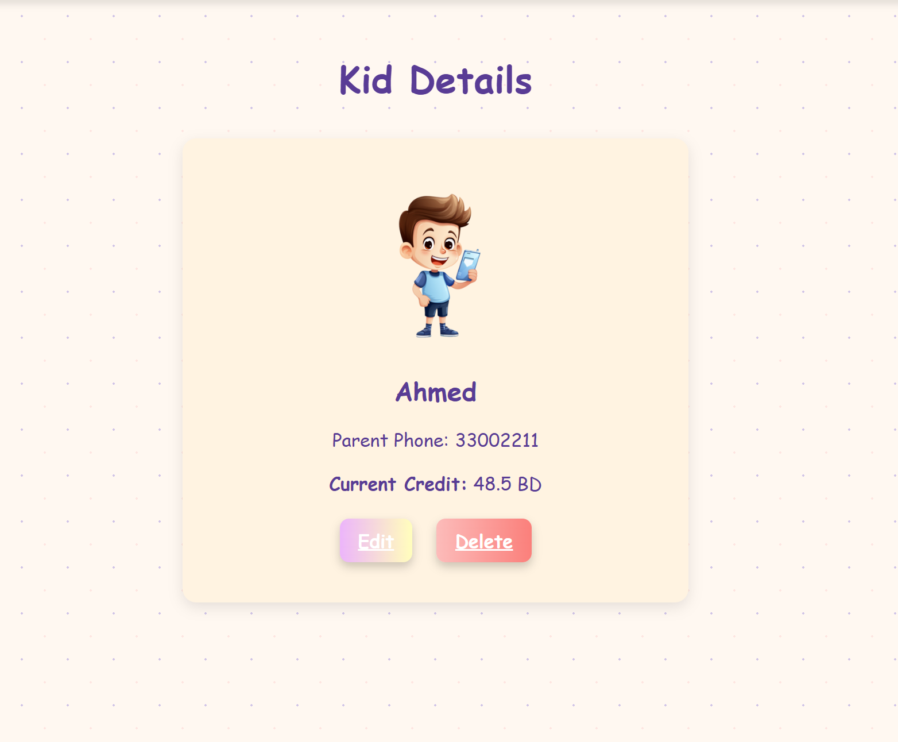
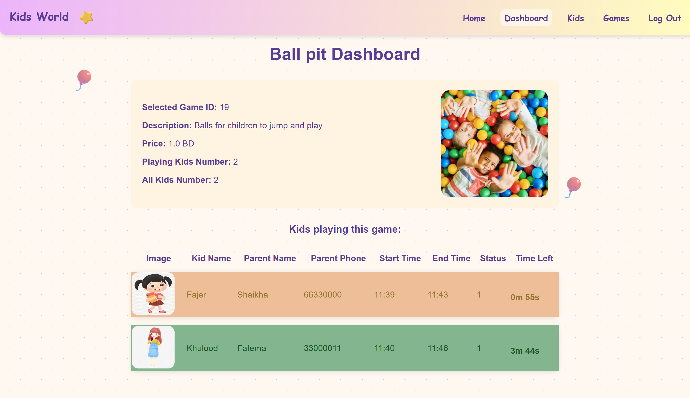

# 🏰 Kids World

**Kids World** is a web application designed for **indoor playgrounds**, helping to organize and manage kids’ play stations more efficiently.  
Instead of the traditional manual process where kids and their information are written down on paper, this system provides a **digital solution** to register children, manage play sessions, and monitor activities in a structured and safe environment.  

The project is built with **Django**.

---

## ✨ Features
- User authentication (login & logout for admin and staff).
- Game management (view game details, add, update, delete).
- Alerts when playtime is over
- Dashboard to view game details and participating kids.
- Role support (Admin, Staff).

---

## 🛠️ Requirements
- Python 3
- Django 
- PostgresSQL

---

## 📸 Screenshots

### 🔑 Login Page

### 🏠 Home Page

### 🎮 Games Page

### 🎮 Games Details

### 👦 Kids Page

### 👦 Kids Details

### 📊 Dashboard

